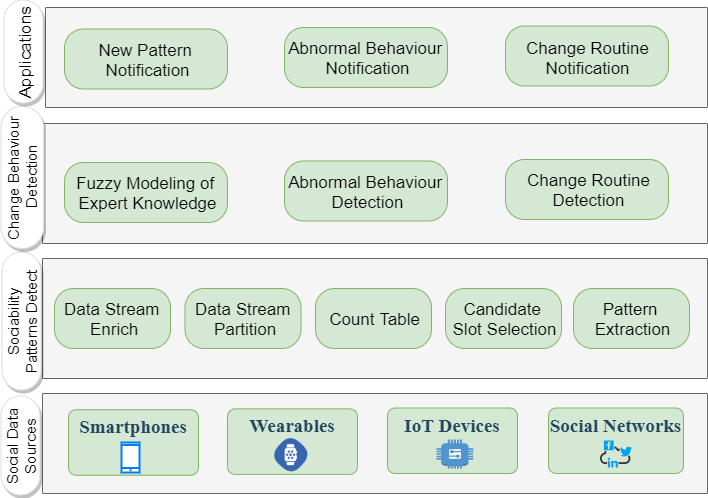
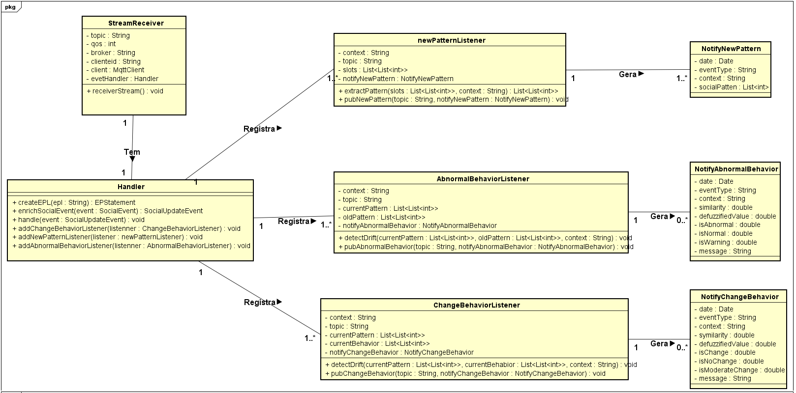

# UbiquitousMentalCare
Projeto e documentação da ferramenta de detecção de padrões de sociabilidade enriquecidos por contexto.

## Este repositório objetiva apresentar um projeto e documentação de uma ferramenta capaz de processar inferências de atividades sociais derivadas de dispositivos pervasivos para detectar padrões de sociabilidade sensíveis ao contexto. A ferramenta é uma biblioteca com uma API bem definida em linguagem Java. O reconhecimento dos padrões de sociabilidade é realizado para contextos específicos (por exemplo, dias úteis, dias chuvosos e fins de semana), permitindo a identificação da variabilidade do comportamento em diferentes condições de contexto. A solução desenvolvida também é capaz de identificar mudanças nos padrões de sociabilidade que refletem comportamentos sociais anormais e variações nas rotinas sociais. Esta solução foi implementada com base na combinação da abordagem de Mineração de Padrões Frequentes (FPM) com o Processamento de Eventos Complexos (CEP). 

# Persona - Psicológa

# Requisitos Funcionais
- (RF01) Reconhecer a variação no comportamento social devido a alterações no contexto (por exemplo, dias da semana, dias úteis, dias chuvosos); 
- (RF02) Identificar os intervalos do dia que nos quais o indivíduo monitorado socializa habitualmente (padrões de sociabilidade);
- (RF03) Notificar aplicações clientes sobre novos padrões de sociabilidade reconhecidos;
- (RF04) Modelar o conhecimento especialista necessário para especificar o limiar de mudança de comportamento;
- (RF05) Reconhecer comportamentos sociais anormais;
- (RF06) Notificar aplicações clientes sobre comportamentos sociais anormais;
- (RF07) Identificar mudanças de rotinas sociais; 
- (RF08) Notificar aplicações clientes sobre mudanças de rotinas sociais.

# Requisitos Não Funcionais
- Interoperabilidade;
- Disponibilidade;
- Confiabilidade;
- Consistência.

# Componentes da Arquitetura

# Diagrama de Classes

# Mais
## [Repositório da Ferramenta](https://github.com/Ivan-Rodrigues/SocialMHealth)

