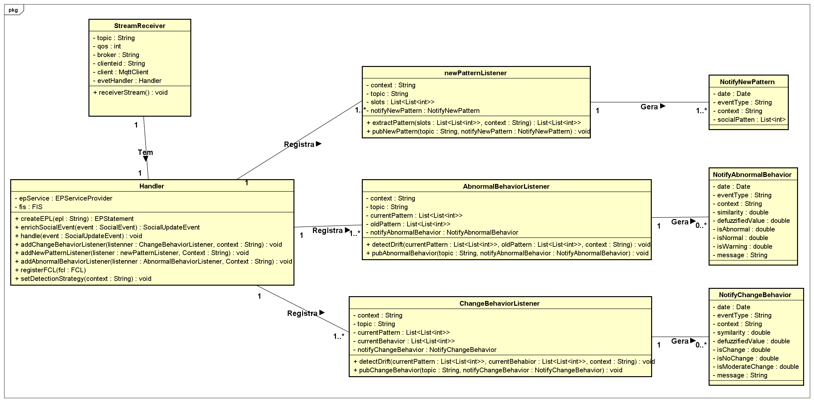
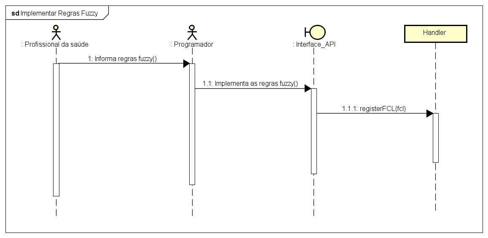
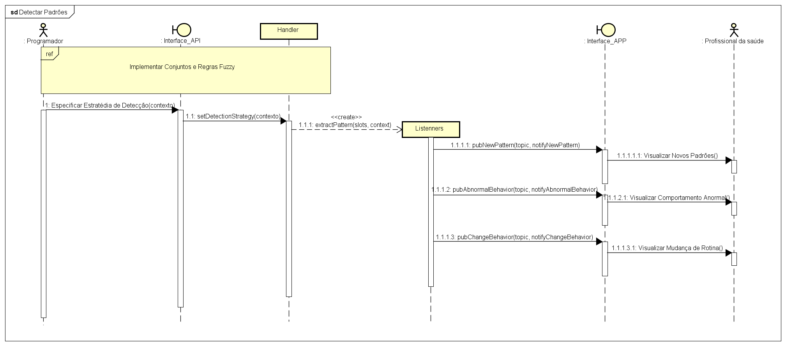

# UbiquitousMentalCare
Projeto e documentação da ferramenta de detecção de padrões de sociabilidade enriquecidos por contexto.

## Este repositório objetiva apresentar um projeto e documentação de uma ferramenta capaz de processar inferências de atividades sociais derivadas de dispositivos pervasivos para detectar padrões de sociabilidade sensíveis ao contexto. A ferramenta é uma biblioteca com uma API bem definida em linguagem Java. O reconhecimento dos padrões de sociabilidade é realizado para contextos específicos (por exemplo, dias úteis, dias chuvosos e fins de semana), permitindo a identificação da variabilidade do comportamento em diferentes condições de contexto. A solução desenvolvida também é capaz de identificar mudanças nos padrões de sociabilidade que refletem comportamentos sociais anormais e variações nas rotinas sociais. Esta solução foi implementada com base na combinação da abordagem de Mineração de Padrões Frequentes (FPM) com o Processamento de Eventos Complexos (CEP). 

# Persona - Psicológa

# Requisitos Funcionais
- (RF01) Reconhecer a variação no comportamento social devido a alterações no contexto (por exemplo, dias da semana, dias úteis, dias chuvosos); 
- (RF02) Identificar e notificar os intervalos do dia que nos quais o indivíduo monitorado socializa habitualmente (padrões de sociabilidade);
- (RF03) Modelar o conhecimento especialista necessário para especificar o limiar de mudança de comportamento;
- (RF04) Reconhecer e notificar comportamentos sociais anormais;
- (RF05) Identificar e notificar mudanças de rotinas sociais; 
- (RF06) Consultar os padrões de sociabilidade identificados e os eventos de mudanças de comportamentos sociais

# Requisitos Não Funcionais
- Modelar o conhecimento especialista: a ferramenta dever identificar mudanças de comportamentos sociais com graus de crença (conhecimento especialista), como mudanças leves, moderas e altas;
- Interoperabilidade: a ferramenta deve se interoperar como fontes de eventos sociais e aplicações clientes interessadas nos padrões de sociabilidade identificados;
- Disponibilidade: a ferramenta deve estar disponível continuamente, visto que as fontes de eventos sociais geram dados a qualquer momento;
- Escalabilidade: a ferramenta deve se adaptar ao crescente fluxo de eventos, buscando escalar de maneira adequada as requisições de serviço;
- Facilidade de uso (API de programação): a API disponibilizada deve fornecer interfaces que sejam de fácil uso, permitindo especificar estratégias de detecção de padrões sem dificuldades.;
- Segurança: os dados trafegados devem ser criptografados e autenticados, devido a natureza pessoal contida nos eventos sociais gerados.

# Componentes da Arquitetura

# Diagrama de Classes

# Diagramas de Sequências
- Implementar Regras Fuzzy

- Detectar Padrões de Sociabilidade

# Mais
## [Repositório da Ferramenta](https://github.com/Ivan-Rodrigues/SocialMHealth)
